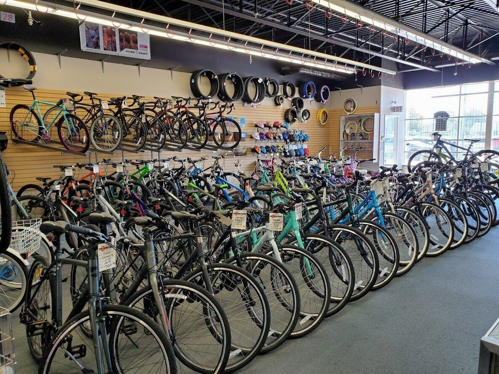
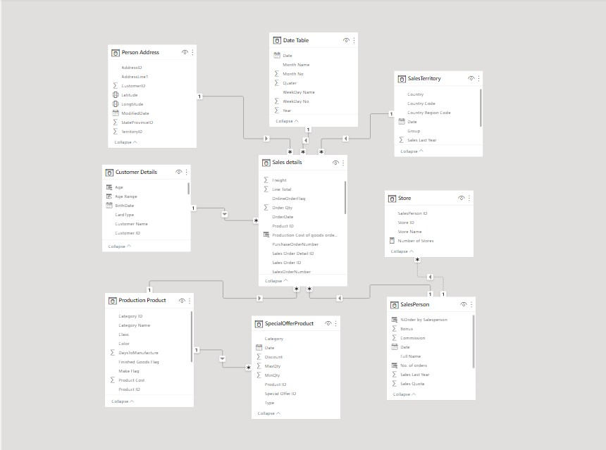
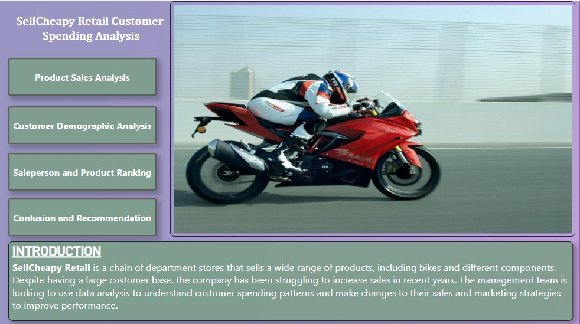
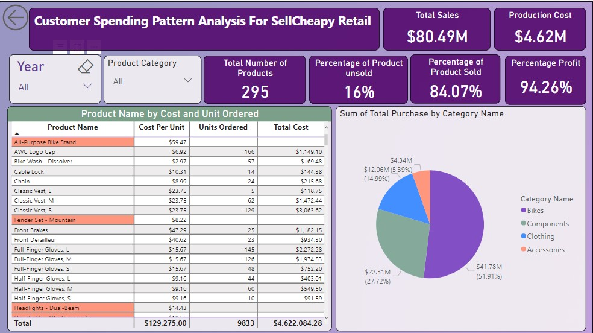
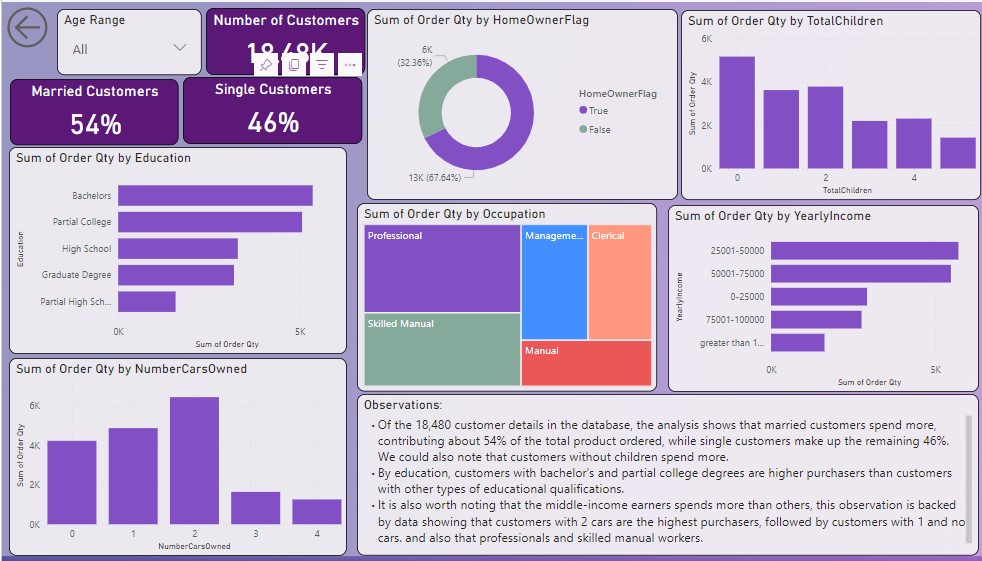

# Customer Spending Pattern Analysis

## Introduction:

This project is a customer spending pattern analysis for Sell Cheapy Retails.

**_Disclaimer_**: _SellCheapy Retail is a fiction chain of department stores that sells a wide range of products, including bikes and different components. The Adventure Works database was used for this analysis_

## Problem Statement: 
Despite having a large customer base, the company has been struggling to increase sales in recent years. The management team is looking to use data analysis to understand customer spending patterns and make changes to their sales and marketing strategies to improve performance.

## Skills and Concepts Demonstrated: 

- Database Restoration in SQL

- Data Cleaning in Power Query

- DAX Query in Power BI

- Data Modelling

- Data Visualisation

- Data Analysis

- Report Publishing to Power BI Service

- Page Navigation

## Modelling

PowerBI detects relationships between tables automatically. Irrelevant relationships were however removed and new relationships were created to achieve desired results
The Star Schema Modelling style was used and data was visualized.

## Visualisation: 
There are about 4 pages of visualization reports that were further analyse;

1. Home page 

2. Product Sales Analysis

3. Customer Demographic Analysis

4. Salespersons and Product Ranking

5. Conclusion and Recommendation

You can interact with the visuals live by clicking [HERE](https://app.powerbi.com/view?r=eyJrIjoiODZlMDQxMmMtMzU1Ny00ZjVkLThiMjAtMjMyNGE2Y2E5MTU0IiwidCI6ImEwYTdmY2JkLWVhMGQtNGQyNy1iNmQxLWQ2NjA2NzA3ZTIzMCJ9)

## Analysis 

### Product Sales Analysis

This page shows the summary of sales with filter on years and product categories with spotlight on products that customers are not spending on at all for reasons that cannot be fanthomed within the scope of this analysis.
Also Most Customers spend on products in the bike category.

### Customer Demographic Analysis

On this page I was able to analyse customer’s spending based on data on some demographic factors. The resulting analysis reflects that of the 18,480 customer details in the database, married customers spend more, contributing about 54% of the total product ordered, while single customers make up the remaining 46%. We could also note that customers without children spend more on SellCheapy’s Products.

## Region and Product Ranking 

Customers in the South west Terriory are the Highest spender and it could also be observed that they have the highest number of stores which shows that the more accessible product stores are, the more customers would be willing to spend.
This page also shows the top 10 and least 5 selling products

## Conclusion And Recommendation

### Conclusion

The following are conclusions deduced from the insight gained in the data provided:

-	The male gender spends more in all categories of products offered by SellCheapy Retail and are the highest purchaser of all categories of products

-	Customers that do not have any children would likely spend more than those with at least 1 child.

-	It is also worth noting that the middle-income earners spends more than others

-	By territory, customers from the southwest make the highest purchases. 

-	Generally customers spends more on purchasing new bikes than any other categories of products.

-	There is a relationship between the quantity order and number of stores by territory, showing that the higher the number of stores in each territory, the higher quantity of products ordered for across all categories.

### Recommendation

Based on the observation and conclusion derived in the course of this analysis, here are some corresponding recommendations:

-	Products that are female centric should be produced or some of the existing products can be rebranded to include some feminine touch so has to get more attention from the female gender.

-	The brand can focus more on promoting values of these products especially the component category where most of the least selling products belongs.

-	Brand should look into training the least selling salespersons and incentivize the top 10 highest selling salesperson to increase productivity and sales.

-	More stores should be open in territories with smaller stores.

-	Finally, brand should focus on targeting the middle-income earners and prospects within the age range 18-49 in her next marketing campaign for maximum result.
